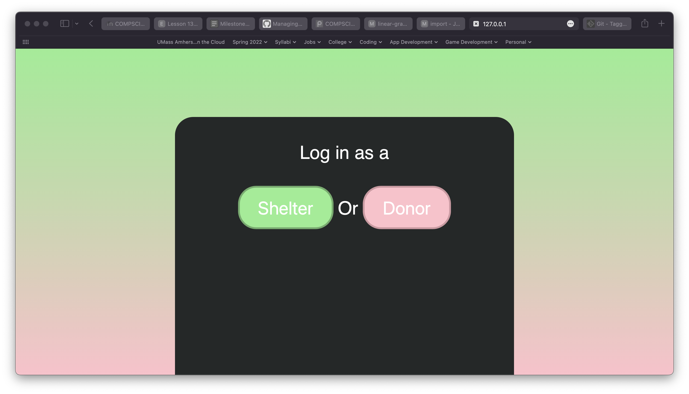
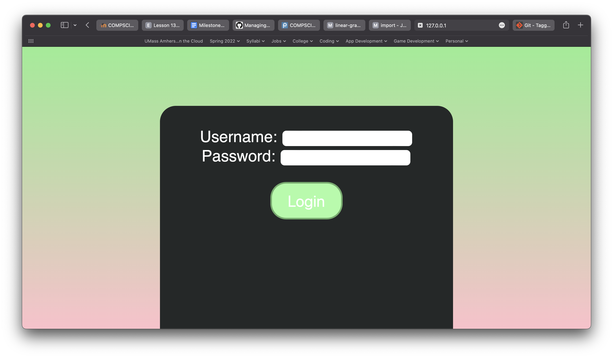
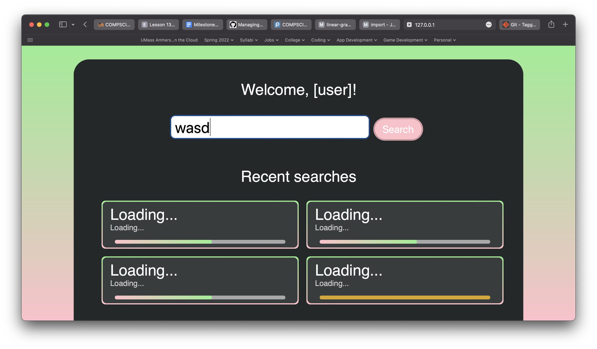
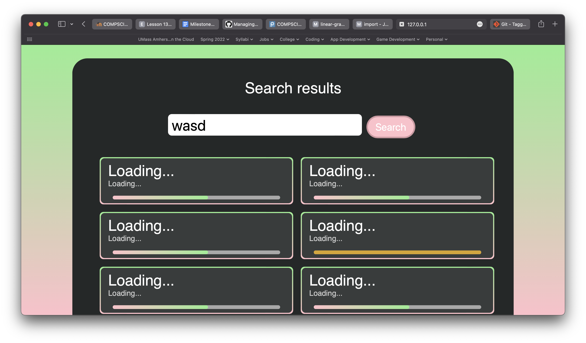
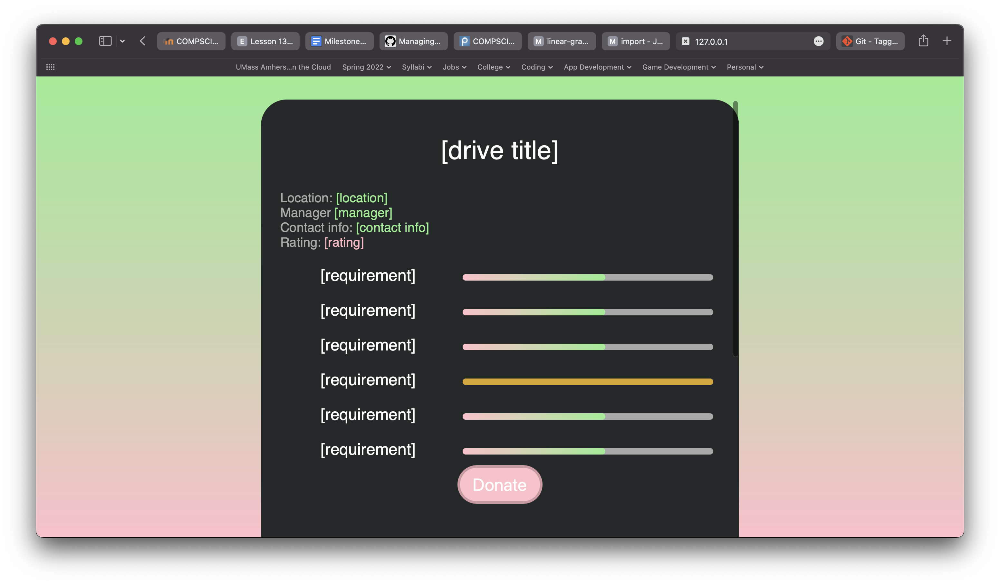
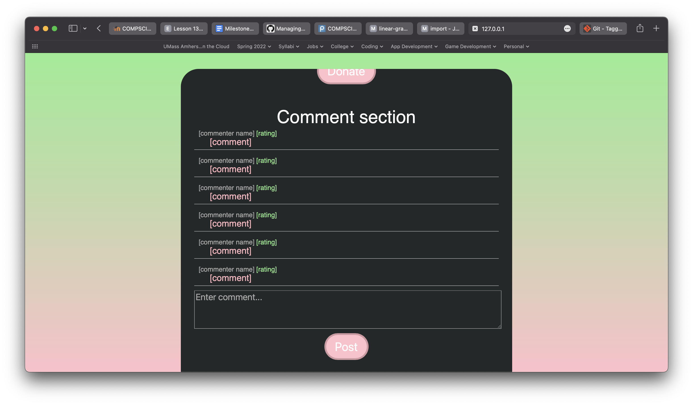
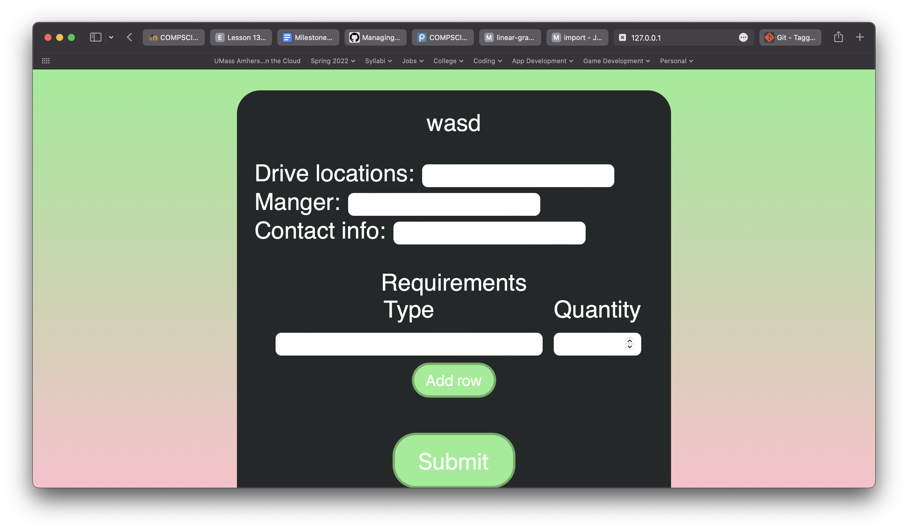

# [object Object] - *Shelter Helper*

## Sections
1. [User Interactions](#user-interactions)
2. [Screenshots](#screenshots)
3. [Video](#video)

## User Interactions*

Initially the users will be faced with a login screen. They are presented with two options: one for shelters, and one for donors. Upon authenticating successfully the user will be brought to a home page that displays a welcome sign. 

If the user is a shelter it will show a text `input` to make a new drive. Beneath that it will show a summary of the past 4 drives they have created. 

If the user is a donor it will show a text `input` to search for drives. Beneath that it will show a summary of the past 4 drives they have donated to. 

Clicking on one of the drives will bring up that drive's page. This will show the drive name, location, associated shelter, and the list of things they need, along with completion bars. It will also have a section for comments. Each donor will have a rating that will display next to their name.

---

**N.B. This is a revised subset of user interactions from my initial milestone. I have made this change in order to focus on completing some features rather than stubbing out many. If I find that I have extra time, I may add them back.*

## Screenshots

The user is greeted with a login screen initially.

Upon logging in the user sees a home screen. Donors are prompted to search, while shelters are prompted to create drives. The most recently viewed/created drives are shown below.

A donor may search for drives.

Clicking a drive brings up additional information.

As well as comments.

A shelter can create a drive and specify the goods needed.

## Video

[Link to video](https://drive.google.com/file/d/186YBlv0dyj3tyadnLvcu2FdYicqoxOMx/view?usp=sharing)